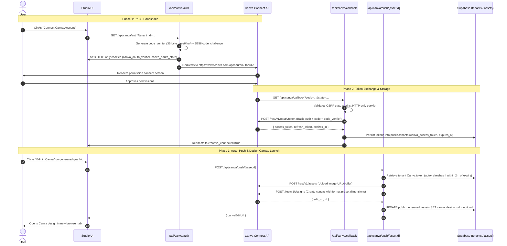

# Eidetic — AI Brand Graphic Studio

Eidetic is an AI-powered design studio that generates pixel-perfect, on-brand social and marketing graphics tailored to strict brand guidelines (colors, typography, voice, logo rules, and aspect ratios).

---

## Getting Started

### 1. Installation

```bash
npm install
```

### 2. Environment Setup

Copy `.env.example` to `.env.local` and provide your API keys:

```bash
cp .env.example .env.local
```

Key environment variables:
- `GEMINI_API_KEY`: Google Gemini API key for prompt orchestration and graphic generation.
- `OPENAI_API_KEY`: (Optional) OpenAI API key for alternative image provider.
- `NEXT_PUBLIC_SUPABASE_URL` & `NEXT_PUBLIC_SUPABASE_PUBLISHABLE_KEY`: Supabase project configuration.

### 3. Supabase Database & Migrations

Eidetic utilizes Supabase for multi-tenant isolation, chat session persistence, generated asset metadata, and storage:

1. **`001_initial_schema.sql`**: Core multi-tenant tables (`tenants`, `users`, `brand_profiles`, `chat_sessions`, `messages`, `generated_assets`) and Row-Level Security (RLS) policies.
2. **`002_storage_setup.sql`**: Supabase storage bucket `brand-assets` configuration with public read access and authenticated upload policies.
3. **`003_chat_persistence.sql`**: Adds `format_preset`, `aspect_ratio`, and nullable `created_by` to `chat_sessions`, plus `brand_profile_id`, `image_url`, `asset_id`, and `metadata` to `messages`.
4. **`004_auth_provisioning.sql`**: Automated trigger on `auth.users` to provision tenant and `public.users` records upon signup.

Apply migrations via Supabase CLI or SQL Editor:
```bash
npx supabase db push
# Or run 001 through 004 in the Supabase Dashboard SQL Editor
```

### 4. Running Locally

* **Standard Dev Mode**:
  ```bash
  npm run dev
  ```
* **Debug Mode (Node Inspector)**:
  ```bash
  npm run dev:debug
  ```
  Connect via Chrome DevTools (`chrome://inspect`) or launch using **F5** in VS Code / Antigravity IDE with the preconfigured `.vscode/launch.json`.

---

## Canva Integration Architecture (Coming Soon Specification)

> [!NOTE]
> Canva integration is currently marked as **Coming Soon** in the UI pending Canva Developer Partner API credential approval. Below is the complete architecture and implementation specification designed for Eidetic.

### Overview

The Canva integration enables 1-click export of AI-generated brand assets into Canva's online editor with pre-set canvas dimensions and layer imports.

### OAuth 2.0 PKCE Flow Blueprint



### Endpoints Specification

1. **`GET /api/canva/auth`**:
   - Generates a cryptographically random PKCE pair:
     - `code_verifier`: 32 random bytes, base64url-encoded.
     - `code_challenge`: SHA-256 hash of `code_verifier`, base64url-encoded (`S256`).
   - Generates a CSRF token: `state = "${tenantId}:${randomNonce}"`.
   - Stores `code_verifier` and `state` in secure HTTP-only cookies.
   - Redirects to `https://www.canva.com/api/oauth/authorize` with scopes:
     `design:content:write design:meta:read asset:write`.

2. **`GET /api/canva/callback`**:
   - Validates `state` against the cookie to prevent CSRF.
   - Exchanges `code` and `code_verifier` for tokens via `POST https://api.canva.com/rest/v1/oauth/token` with HTTP Basic Authorization header (`base64(client_id:client_secret)`).
   - Updates `public.tenants`:
     - `canva_connected = true`
     - `canva_access_token = access_token`
     - `canva_refresh_token = refresh_token`
     - `canva_token_expires_at = now() + expires_in`
   - Clears temporary cookies and redirects to `/?canva_connected=true`.

3. **`POST /api/canva/push/[assetId]`**:
   - Reads tenant's access token from `public.tenants`.
   - Checks if expired; if so, performs token refresh (`grant_type: refresh_token`) and updates DB.
   - Uploads graphic to Canva assets (`POST https://api.canva.com/rest/v1/assets`).
   - Creates a new design preset with exact canvas dimensions (`POST https://api.canva.com/rest/v1/designs`).
   - Updates `public.generated_assets.canva_design_url = data.edit_url`.
   - Returns `{ canvaEditUrl }` to open Canva editor in a new tab.

4. **`GET / DELETE /api/canva/status`**:
   - `GET`: Checks if the active tenant has an authenticated connection.
   - `DELETE`: Disconnects Canva by clearing tokens and resetting `canva_connected = false`.

### Database Schema Support

The database migration ([`supabase/migrations/001_initial_schema.sql`](file:///Users/divi/.gemini/antigravity-ide/scratch/eidetic/supabase/migrations/001_initial_schema.sql)) already provides full schema support:
- `tenants.canva_connected` (boolean)
- `tenants.canva_access_token` (text)
- `tenants.canva_refresh_token` (text)
- `tenants.canva_token_expires_at` (timestamptz)
- `generated_assets.canva_design_url` (text)

---

## Roadmap

- [x] AI Prompt Orchestration (5-layer brand synthesis).
- [x] AI Graphic Generation Engine (Gemini & OpenAI native image generation).
- [x] Multi-format Presets & Custom Aspect Ratios.
- [x] Supabase Multi-Tenant Schema & Storage Migrations.
- [ ] **Canva Connect Partner API Integration** (Architecture documented, pending API keys).
- [ ] Automated Brand Guidelines PDF Extraction via Gemini Vision.
- [ ] Stripe Subscription & Quota Enforcement.
